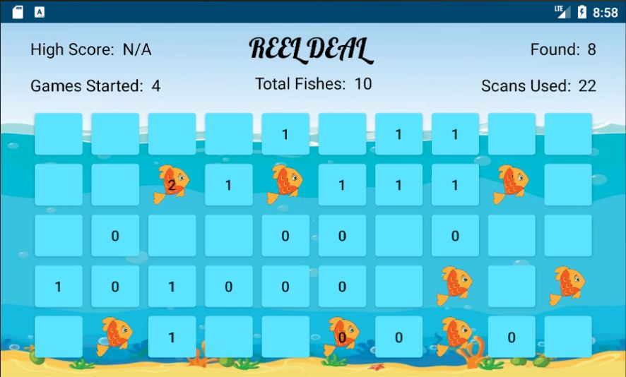
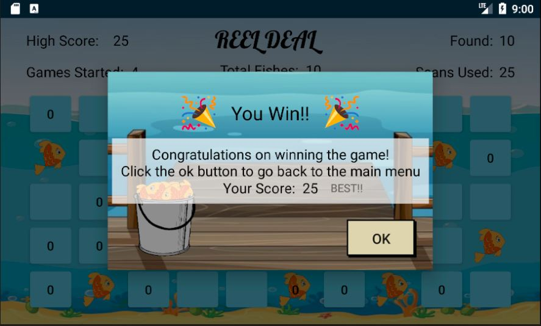
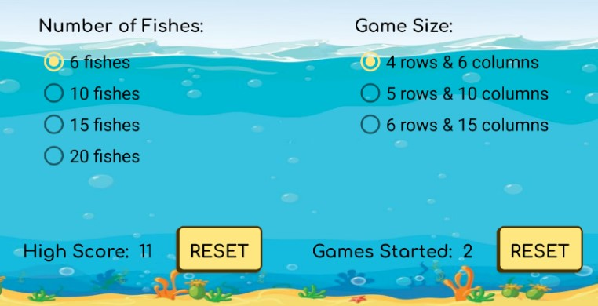

# Reel Deal
An Android app based on the classic Mine Seeker game. Players must reel in the fishes and compete for high scores.

### Tasks (Additional Features)
- [x] Welcome screen: animation
  - [x] 1.3 Welcome screen includes two or more different animations (ex. fade, spin, or move) & complicated animations (ex. rotating, moving blocks at once)
  - [x] 1.5 Welcome screen automatically advances to the Main Menu after all animations have finished, plus at least 4 extra seconds
- [x] Main menu: nice buttons and enhanced screen look
  - [x] 2.5 Buttons displayed are fancy and visually appealing featuring icons
- [x] Game: Scanning animation along row/column when scanning for mines
- [x] Game: Play sound on scan and on find a mine
- [x] Game: Save game state if app closed while game playing
  - [x] Restarting app restarts game where you were
  - [x] 3.10 Scanning animated to show a scan happening (ex. ship's radar searching, pulse wave going out across the row and column)
  - [x] 3.11 App plays a sound when it scans and when the user finds a mine
  - [x] 3.12 App vibrates when it scans and when the user finds a mine, different vibration feel for each
  - [x] 3.13 Displays text stating the total number of games started (saved between application launches)
  - [x] 3.14 Displays text stating the best score so far of any completed game of this specific configuration (board size & number of mines); must save best score for each possible configuration
  - [x] 5.5 App saves game state if app is closed while playing.
- [x] Display & save # games started (total), and best score between launches
  - [x] Options screen able to reset number games played to 0, and clear all high scores
  - [x] Must store best score for each possible game configuration and display the best score for the current configuration while playing the game
  - [x] 5.4 Allows user to reset number of times game has been played, and best scores for each game configuration

## Configurations
Minimum SDK Version: 24.0

Compatible Devices (reccommended): Pixel API 24, Pixel 2 API R

## Run
1. Download this repository, extract from zip, and open the project folder in Android Studio
2. Select a device
3. Run `SHIFT+F10`

## Game Play
Players find fishes by clicking the blue grid of buttons. If a fish is found an image of the fish will display. If a fish is not found, a sonar scan is performed. The scan calculates the amount of undiscovered fish in that row and column.

Once the player has found all fishes, the game is over and the score is calculated based on how many scans were performed.

Players can compete for high scores by reducing the amount of scans used.

## Settings
The settings can be changed within the __Options__ Page.

Settings include:
* Number of Fishes: 6/10/15/20
* Game Size (row x col): 4x6/5x10/6x15